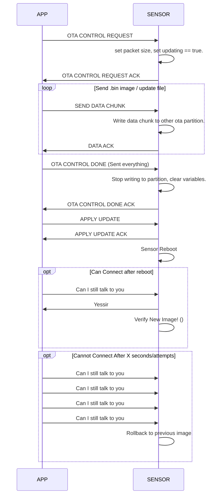

# RUSTY SENSOR

This repository is the firmware for the valirutus sensor.

### OTA Update mechanisim 
(happy path only for now, todo: add in error paths)

```mermaid  
  sequenceDiagram
      APP->>SENSOR: OTA CONTROL REQUEST
      SENSOR->>SENSOR: set packet size, set updating == true.
      SENSOR->>APP: OTA CONTROL REQUEST ACK

      loop Send .bin image / update file
        APP->>SENSOR: SEND DATA CHUNK
        SENSOR->>SENSOR: Write data chunk to other ota partition.
        SENSOR->>APP: DATA ACK
      end

      APP->>SENSOR: OTA CONTROL DONE (Sent everything)
      SENSOR->>SENSOR: Stop writing to partition, clear variables.
      SENSOR->>APP: OTA CONTROL DONE ACK

      APP->>SENSOR: APPLY UPDATE 
      SENSOR->>APP: APPLY UPDATE ACK

      SENSOR->>SENSOR: Sensor Reboot

      opt Can Connect after reboot
        APP->>SENSOR: Can I still talk to you
        SENSOR->>APP: Yessir
        SENSOR->SENSOR: Verify New Image! ()
      end
      opt Cannot Connect After X seconds/attempts
        APP->>SENSOR: Can I still talk to you
        APP->>SENSOR: Can I still talk to you
        APP->>SENSOR: Can I still talk to you
        APP->>SENSOR: Can I still talk to you
        
        SENSOR->SENSOR: Rollback to previous image
      end

```

