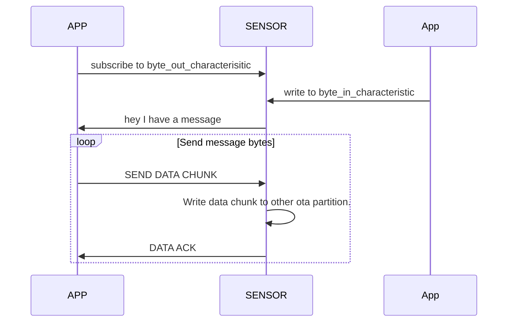
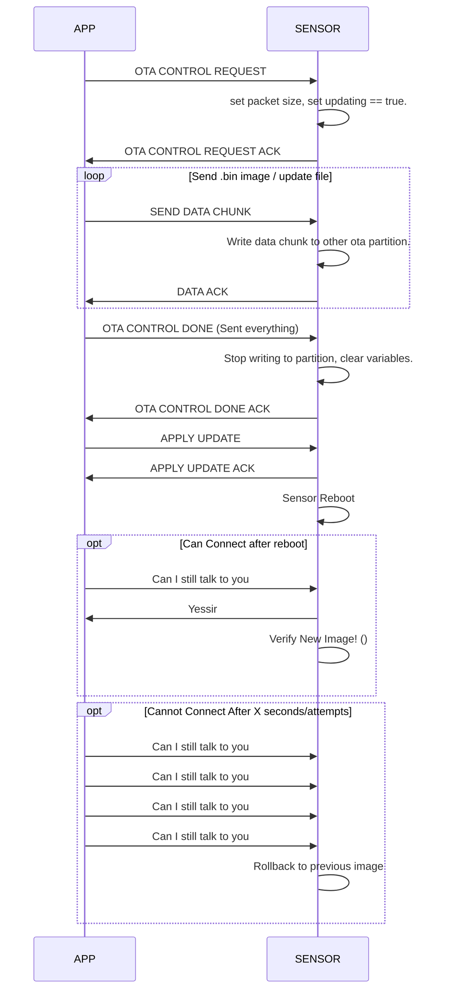

# RUSTY SENSOR

This repository is the firmware for the valirutus sensor.

## Dev notes

Code that is hardware agnostic should be split into sub crates where it can be unit tested, i.e. the app_state sub crate.
The root project, should contain the hardware specific code and contains the entry point of the application. 

## building and flashing firmware

Need to install espflash from cargo
cargo install espflash

#### flashing and monitoring the sensor

espflash --monitor /dev/ttyUSB0 --partition-table partitions_two_ota.csv /home/lance/rusty-sensor

you may need to erase flash if an ota partition is active

#### Creating update file

espflash save-image esp32 rusty-sensor esp.bin

## Messaging Diagram

## OTA Update mechanisim 
(happy path only for now, todo: add in error paths)

